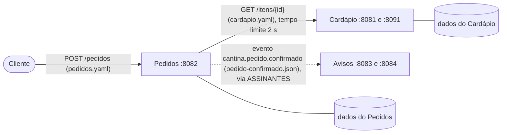

# Visão de estrutura

```mermaid
flowchart LR
  cliente([Cliente]) -->|"POST /pedidos (pedidos.yaml)"| pedidos["Pedidos :8082"]
  pedidos -->|"GET /itens/{id} (cardapio.yaml), tempo limite 2 s"| cardapio["Cardápio :8081 e :8091"]
  pedidos -.->|"evento cantina.pedido.confirmado (pedido-confirmado.json), via ASSINANTES"| avisos["Avisos :8083 e :8084"]
  pedidos --- dbP[("dados do Pedidos")]
  cardapio --- dbC[("dados do Cardápio")]
```

Linha contínua: chamada síncrona. Linha tracejada: evento.